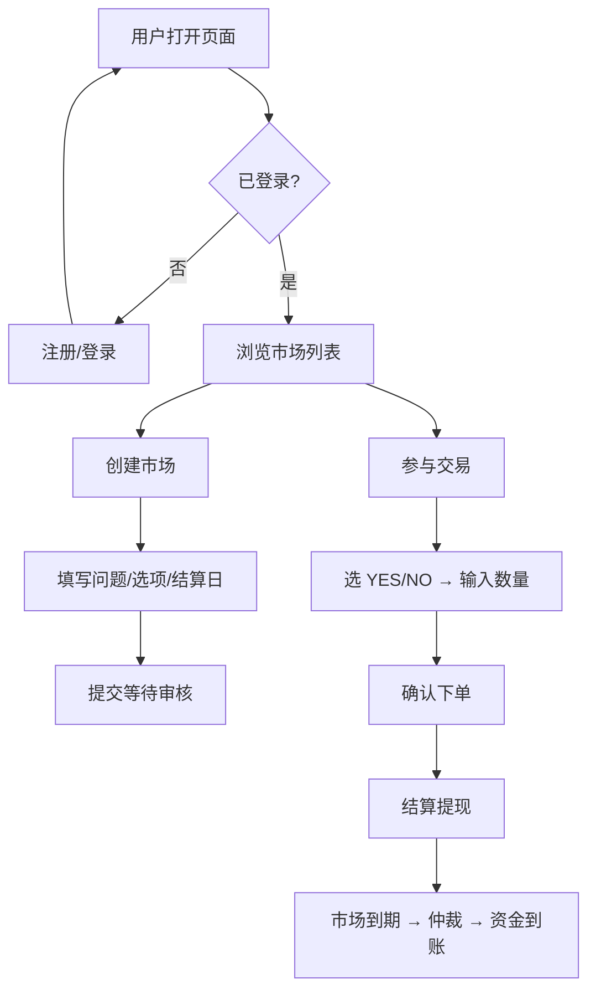
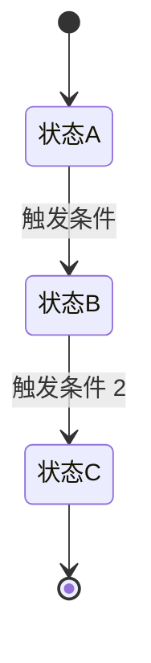

# SPRINT-{NNN}: {冲刺名称 — 面向 PM/业务方}

> **负责人**: PM / 产品经理
> **所属迭代**: {Sprint 编号，如 Sprint 12}
> **状态**: planning → active → done
> **⚡ 本文档不决定技术方案**。可以列举技术方案选项供产品理解，但不得锁定确定性技术架构或代码实现。所有确定性技术设计进入 Dev 的 specs。

---

## 一、冲刺目标 (Sprint Goal)

{一句话说清楚这个 sprint 要交付什么业务价值。例如："完成用户端市场创建流程，让用户能自主发题并进入 YES/NO 交易"}

## 二、功能清单 (Feature List)

| # | 功能 | 优先级 | 关联用户场景 | 预期工时(人天) |
|:-:|:----|:-----:|:-----------|:-------------:|
| F1 | {功能名} | P0 | UC-01, UC-02 | 3 |
| F2 | {功能名} | P1 | UC-03 | 2 |
| F3 | {功能名} | P2 | UC-04 | 1 |

**P0** = 核心路径，不完成 sprint 不关闭 | **P1** = 重要但可后置 | **P2** = 锦上添花

## 三、业务流程 (Business Process Flow)

> 优先用 Mermaid 泳道图（GitHub 原生渲染）；环境不支持时用 ASCII 备选。只画业务流转，不画技术实现。

### 3.1 {核心流程名称}

### 3.2 {子流程名称}

## 四、业务状态与转换 (Business States & Transitions)

| 实体 | 状态 | 进入条件 | 离开条件 | 业务含义 |
|:----|:----|:--------|:--------|:--------|
| {实体} | {状态 1} | {什么条件进入} | {什么条件离开} | {这个状态对用户意味着什么} |
| | {状态 2} | ... | ... | ... |
| {实体 2} | {状态 1} | ... | ... | ... |

## 五、功能详述 (Feature Details)

### F1: {功能名称}

**用户故事**: 作为{角色}，我希望{目标}，以便{价值}

**前置条件**:
- {条件 1}
- {条件 2}

**正常流程**:
1. {步骤 1 — 用户操作}
2. {步骤 2 — 系统反馈}
3. {步骤 3 — 用户操作}
4. {步骤 4 — 完成状态}

**异常流程**:
| 场景 | 触发条件 | 期望表现 |
|:----|:--------|:--------|
| {异常 1} | {什么导致异常} | {用户看到什么} |
| {异常 2} | {什么导致异常} | {用户看到什么} |

**业务验收条件** (从产品视角 — 不是技术验收)：
- [ ] {条件 1 — 用业务语言描述}
- [ ] {条件 2}
- [ ] {条件 3}

### F2: {功能名称}

...

## 六、技术方案选项参考 (Tech Option Reference)

> **⚡ 本节的目的是辅助产品对实现预期有个了解，不是技术决策**。
> 列出可能的技术实现路径，供 PM 和 TL 在 sprint 评审时对齐预期。
> 最终技术方案由 Dev 在 specs 中确定，不受本节约束。

### F1: {功能名} — 技术选项

| 选项 | 简述 | 复杂度 | 影响 |
|:----|:-----|:------:|:-----|
| 方案 A | {高层面描述，如"利用现有模块 X 扩展"} | 低/中/高 | {对前端/后端的影响} |
| 方案 B | {如"引入新服务 Y"} | 低/中/高 | {对资源/时间的影响} |

**PM 偏好方向**: {如果 PM 有倾向，可说明原因}

### F2: {功能名} — 技术选项

...

## 七、依赖关系 (Dependencies)

| 依赖类型 | 依赖内容 | 提供方 | 预期就绪时间 |
|:--------|:--------|:------|:-----------|
| 内部依赖 | {依赖的 sprint 或其他内部模块} | {团队} | {时间} |
| 外部依赖 | {第三方 API、服务商、机构} | {外部} | {时间} |

## 八、本次 Sprint 不涵盖的 (Out of Sprint Scope)

- ✗ {明确不做的事} — {理由}
- ✗ {明确不做的事} — {理由}

## 九、评审确认 (Review Sign-off)

| 角色 | 确认内容 | 签名 |
|:----|:--------|:----|
| PM | 业务逻辑正确、场景完整 | ☐ |
| TL | 在技术上可实现（但本文档不写方案） | ☐ |
| 业务方 | 满足业务需求 | ☐ |

---

> **写完后做什么**: 将本 sprint 的功能拆解为 spec 组（spec/SPEC-XXX/），由开发者补充架构设计和技术方案。
> **下一个文档**: 前往 `spec/_template/` 开始为每个 spec 准备四文件。
