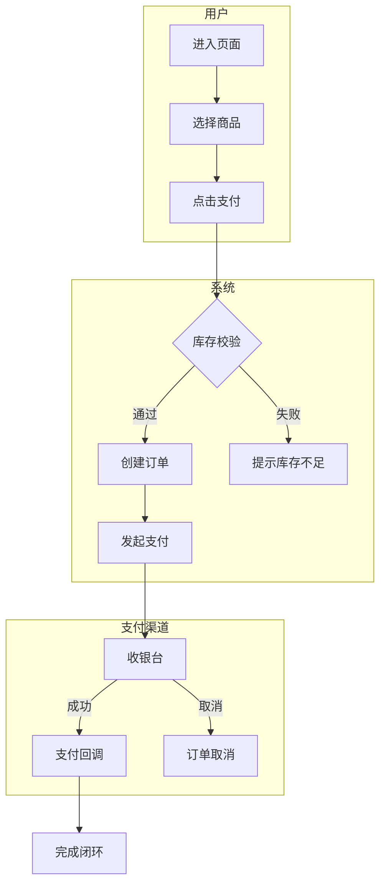
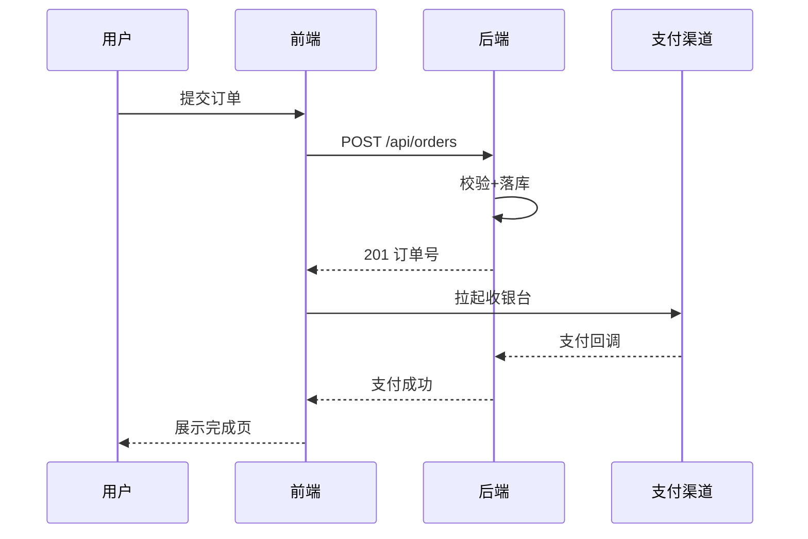
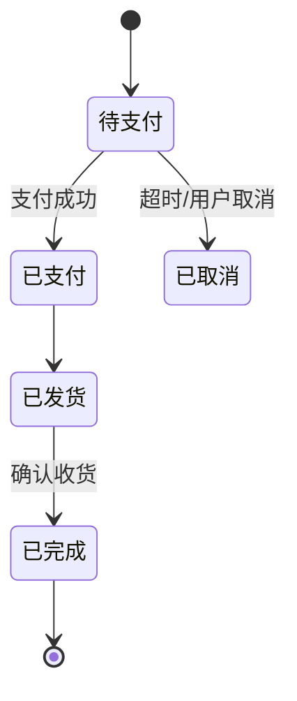

# SPRINT-{NNN}: {冲刺名称} — 业务流程图

> **负责人**: PM / 产品经理
> **用途**: 核心业务流程的图表化表达——泳道流程图 / 时序图 / 状态图，让业务闭环一眼可见。
> **图表规范**: 优先使用 **Mermaid**（GitHub 原生渲染）；若工具环境不渲染 Mermaid，可用 ASCII 图替代并标注「ASCII 备选」。
> **与 user-scenarios.md 的分工**: 本文件用**图表式**描述"流程怎么走"；`user-scenarios.md` 用**叙述式**（旅程阶段表 + 用例）描述"用户经历什么"。两者互补不重复。
> **最少必要原则**: 核心业务流程图必写；其余图表按业务复杂度按需绘制——能用一个图说清就不画第二个。

---

## 1. 核心业务流程图（必写）

> 泳道图（Mermaid `flowchart` + `subgraph`）：横向/纵向泳道区分参与方（用户 / 前端 / 后端 / 支付…）。

> 分支/异常流也要画出来（校验失败、超时、取消），异常分支是业务闭环的一部分。

---

## 2. 关键交互时序图（按需）

> 场景：跨多方的时序交互（如 用户-前端-后端-第三方），用 Mermaid `sequenceDiagram`。

---

## 3. 状态转换图（按需）

> 场景：业务对象有明确生命周期（订单 / 任务 / 审批流），用 Mermaid `stateDiagram-v2`。

---

## 4. 图表选择速查

| 想表达什么 | 用什么 | 必写度 |
|:--------|:------|:-----:|
| 业务闭环全貌 | 旅程总览表（在 `user-scenarios.md` §1） | ⭐⭐⭐ 必写 |
| 多方参与的流程走向 | 泳道流程图（§1） | ⭐⭐⭐ 核心流程必写 |
| 跨系统时序交互 | 时序图（§2） | ⭐⭐ 有第三方/多系统时写 |
| 对象生命周期 | 状态图（§3） | ⭐⭐ 有状态机时写 |
| 用例范围/ER 数据模型/其他 | 见 `uml-pack.md` | 按需 |
