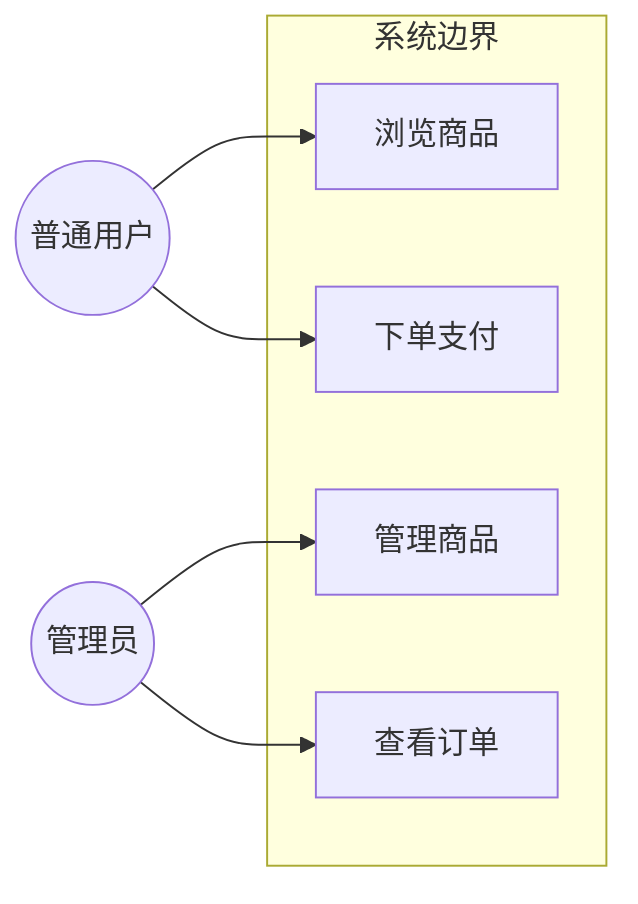
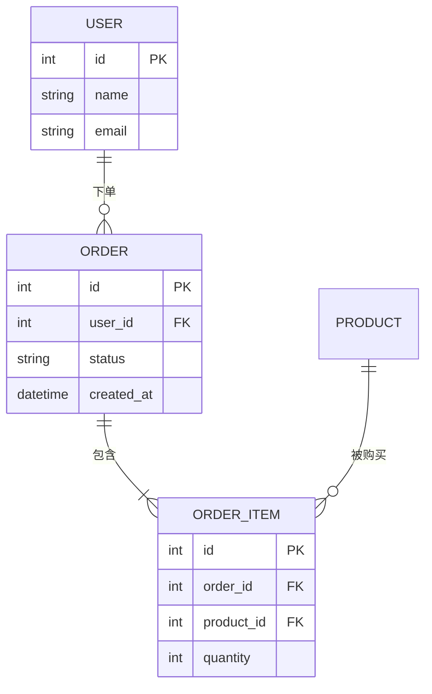
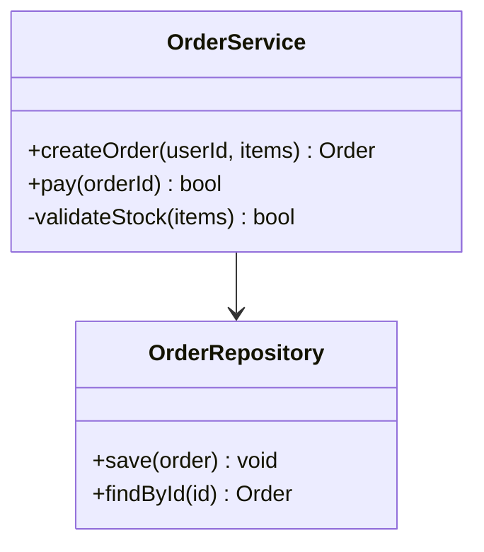
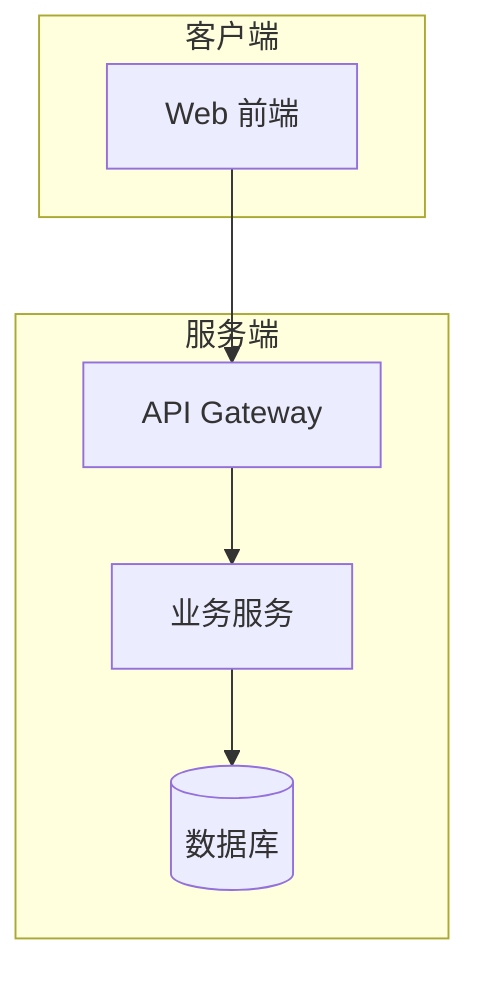

# SPRINT-{NNN}: {冲刺名称} — UML 图表包（按需选用）

> **负责人**: PM（用例图）/ Dev（ER、类图、架构图）
> **用途**: 软件工程标准图表的「工具箱」——`business-flows.md` 之外的补充图表，按项目实际需求选用。
> **⚠️ 最小化数量原则（核心）**: **不追求全量绘制**。根据项目实际需求和业务情况判断，只画「能说清一个关键问题」的必要图表。能用文字/旅程总览说清的，就不画图；能用一个图说清的，就不画第二个。极简项目可整文件一行占位「本项目不需要 UML 图表」。
> **格式**: 优先 Mermaid；环境不渲染时用 ASCII 备选。

---

## 0. 选择指引（先查这张表，再决定画什么）

| 想表达什么 | 用什么图 | 放哪 | 何时需要 |
|:--------|:--------|:----|:--------|
| 业务闭环/流程走向 | 旅程总览（user-scenarios）+ 泳道流程图 | `user-scenarios.md` §1 / `business-flows.md` | 必写 |
| 跨系统时序交互 | 时序图 | `business-flows.md` | 有第三方/多系统 |
| 对象生命周期 | 状态图 | `business-flows.md` | 有状态机 |
| 谁在用系统、有哪些用例 | 用例图（§1） | 本文件 | 多角色/多权限系统 |
| 核心数据模型 | ER 图（§2） | 本文件 | 有数据库/核心实体 |
| 模块/类结构 | 类图（§3） | 本文件 | 复杂业务代码结构 |
| 系统架构全景 | C4 架构图（§4） | 本文件 | 多服务/多组件系统 |

> **决策规则**: 表格中「何时需要」不满足 → 不画。画之前问一句：**这张图能帮 Dev 或评审的人少踩一个坑吗？** 不能 → 删掉。

---

## 1. 用例图（Use Case）

> 适用：多角色、多权限、需要说清「谁 → 能做什么」的系统。
> Mermaid 无原生用例图，用 `flowchart` + `subgraph` 模拟（椭圆=用例，方框=参与者）。

---

## 2. ER 图（数据模型）

> 适用：有数据库表设计、核心实体关系的系统（Dev 层）。

---

## 3. 类图（Class Diagram）

> 适用：复杂业务代码的模块/类结构说明（Dev 层）。

---

## 4. C4 架构图（系统上下文）

> 适用：多服务/多组件系统，说明模块边界与依赖（Dev 层）。

---

## 5. 填写规则

1. 每个图必须有**一句话说明**「这张图回答什么问题」。
2. 图与图之间**不重复表达同一信息**（重复 → 删后者，保留更全的那个）。
3. 本迭代不涉及的图表类型，**直接不出现**，不要放空模板占位（整文件级占位仅在极简项目使用，见头部）。
